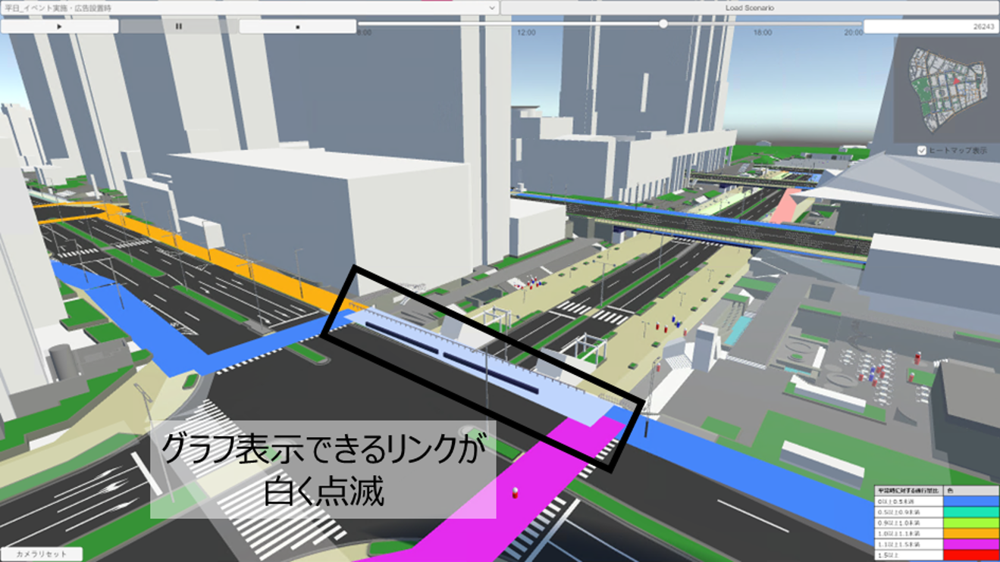

# グラフ機能
この機能は、歩行シミュレーションの結果として、通行量と通行量の変化を定量的にグラフで表示する機能です。

## 機能概要
- 通行量比の大きい道路に対して、マーカーを設置しています。
- マーカーをクリックすると、10分ごとの通行量や通行量比の時間変化を示したグラフがポップアップされます。
- グラフタイトルには通りの名称と周辺の代表的な地名を記載しており、グラフからも場所を確認することが可能です。

## 操作方法
- ヒートマップを表示した状態で、ヒートマップが白く点滅するリンクが存在します。点滅しているリンクが、グラフを表示する対象道路です。

- 点滅しているリンクをクリックすると、グラフが画面中央に表示されます。

