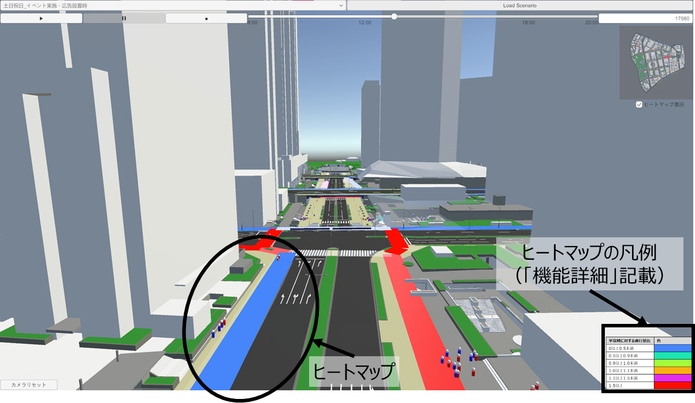
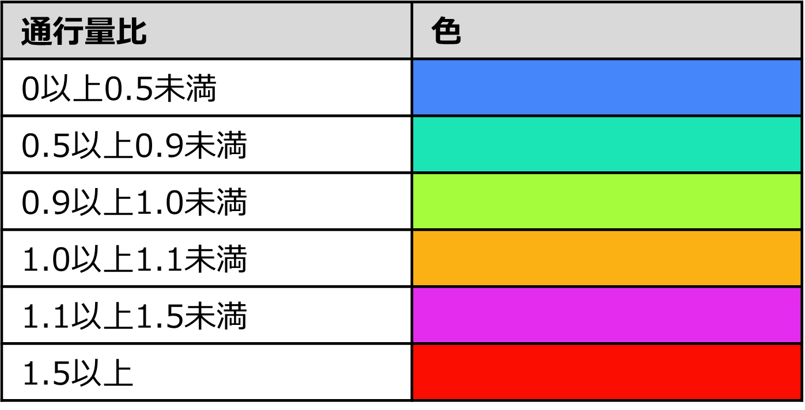
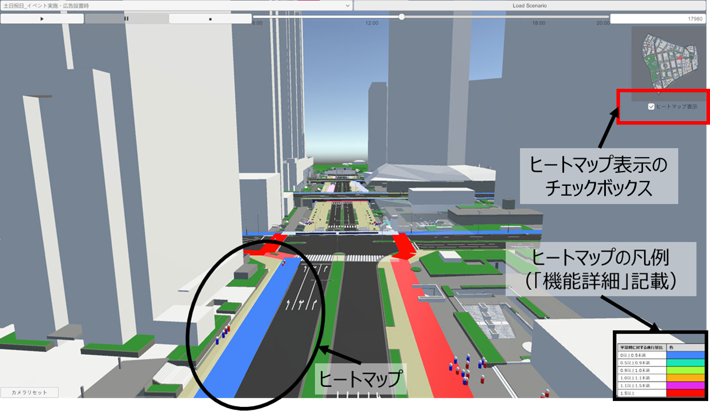

# ヒートマップ機能
この機能は、歩行シミュレーション結果の分析として、通行量の変化をヒートマップで表示する機能です。

## 機能概要
- 歩行シミュレーション結果として出力されるJSONファイルには、リンクのポリゴン（形状）データ、10分おきに集計された通行量比が含まれています。
    - 通行量比とは、イベント実施時の効果を測定する指標として設定したものであり、平常時の通行量に対する、シナリオ時の通行量の比を示したものです。
- JSONファイルに従って、10分おきにその時刻における通行量比をヒートマップで表示します。
- ヒートマップの凡例は下記図の通りです。

## 操作方法
- 歩行シミュレーション結果可視化実行を行うことで、ヒートマップが自動的に表示されるため、特別な操作は不要です。
- ヒートマップの表示を消したい際は、対象地区の俯瞰図の下にあるチェックボックスのチェックを外してください。

