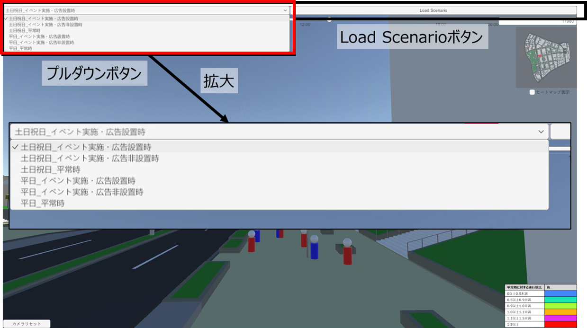
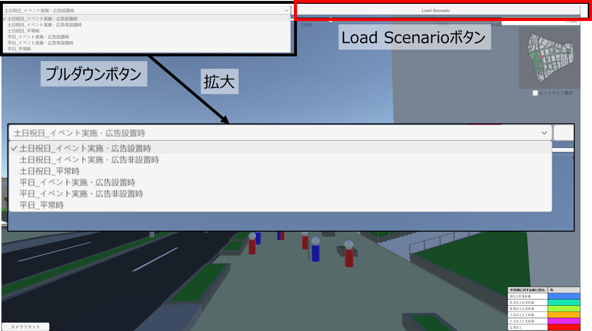

# 人流切り替え機能
この機能は、確認したいシナリオに応じて、表示するデータを切り替える機能です。

## 機能概要
- プルダウンでシナリオを切り替えられるUIを設置しています。
- シナリオをプルダウンで設定後、「Load Scenario」を押すと、表示したいデータが読み込まれます。

### 確認できるシナリオ
- 確認できるシナリオは次の6つです。
    - 平日_平常時
    - 平日_イベント実施・広告非設置時
    - 平日_イベント実施・広告設置時
    - 土日祝日_平常時
    - 土日祝日_イベント実施・広告非設置時
    - 土日祝日_イベント実施・広告設置時

## 操作方法
1. プルダウンボタンから確認したいシナリオを設定します。

2. 「Load Scenario」を押し、確認したいデータを読み込みます。

