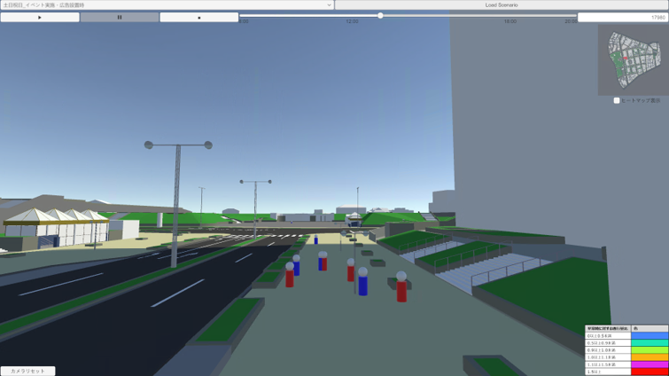
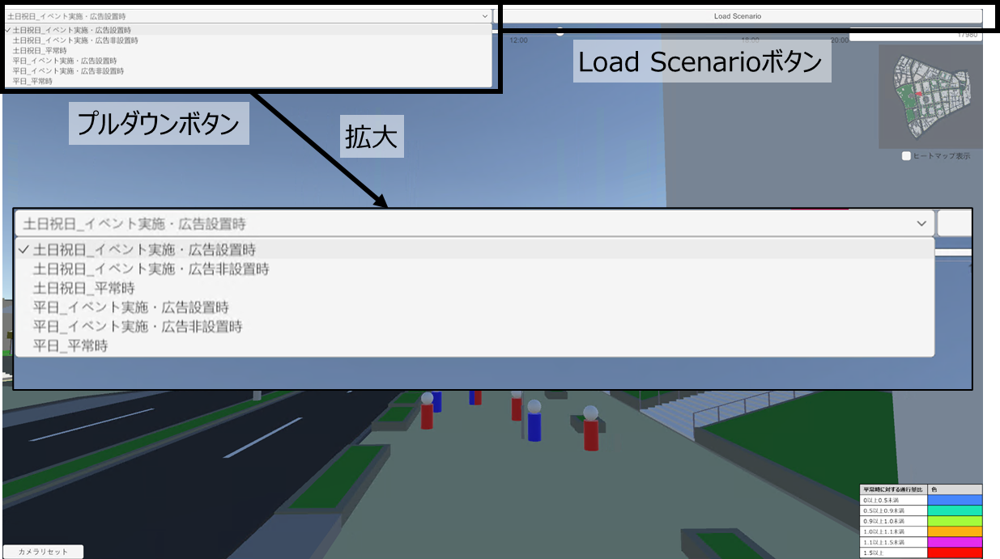
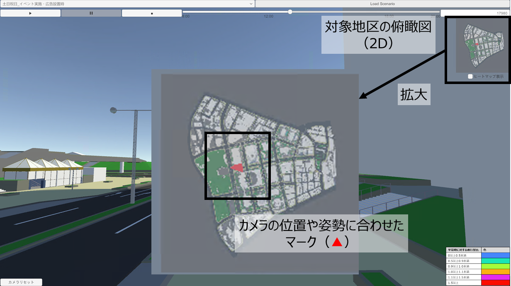
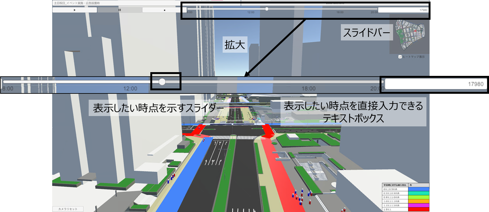
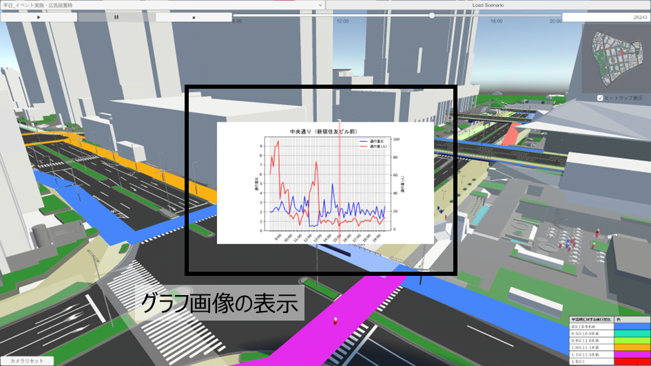

# 機能一覧
本アセットは、下記の6つの機能を新たに整備しています。

## エージェント可視化機能
歩行シミュレーションの結果に応じてエージェント（人）を動かす機能

## 人流切り替え機能
確認したいシナリオに応じて、表示するデータを切り替える機能

確認できるシナリオは次の6つです。
- 平日_平常時
- 平日_イベント実施・広告非設置時
- 平日_イベント実施・広告設置時
- 土日祝日_平常時
- 土日祝日_イベント実施・広告非設置時
- 土日祝日_イベント実施・広告設置時

## ガイド機能
画面が表示されている方向やその位置を俯瞰的に確認できる機能

## ヒートマップ機能
歩行シミュレーション結果の分析として、通行量の変化をヒートマップで表示する機能

凡例

## 時系列人流可視化機能
時間ごとの人流をスムーズに表示するスライドバー機能

## グラフ機能
歩行シミュレーションの結果として、通行量と通行量の変化を定量的にグラフで表示する機能

