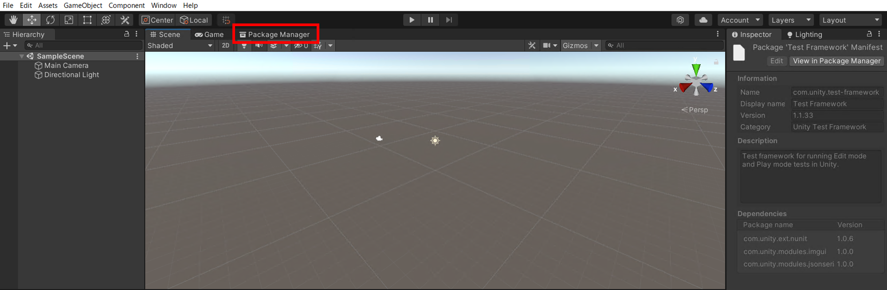

# インストール方法
ここでは、歩行シミュレーション結果アセットのインストール方法を記載します。

## 動作環境、前提ソフトウェア、必要ライセンス、必要パッケージ
### 動作環境
- Unity LTS Release2021.3.19f1
    - 2023年1月時点における長期サポートバージョン
    - 参考：[Unity Long Term Support](https://unity.com/releases/editor/qa/lts-releases)

Unityのインストールについては、[こちら（参考：Unityのインストール方法）](UnityInstallation.md)をご覧ください。

### 必要ライセンス
- Unity Personal以上
    - 参考：Unity [Choose the plan that is right for you](https://store.unity.com/compare-plans)

### 必要パッケージ
- Newtonsoft Json
    - インストールの方法は次の手順の通りです。
    
1. Unityプロジェクトを立ち上げると、「Package Manager」がタブに表示されます。
    
    
2. そのタブをクリックし、「+」ボタンを押すと、「Add package from git URL…」が表示されるので、クリックします。
    
    
3. テキストボックスが表示されるので、「com.unity.nuget.newtonsoft-json」と記入します。
    
    
4. 「Add」ボタンを押すと、インストールが完了します。
    

## インストール手順
1. 本リポジトリ内のあるファイル一式を「Code」> 「Download Zip」からダウンロードします。

2. ダウンロードされた「PLATEAU-UC22-023-Pedestrian-Simulation-Result-Viewer.zip」ファイルを解凍し、「pedestrianflowviewer.unitypackage」を取得します。

3. Unity Editorを起動し、「Import Package」>「Custom Package」から「pedestrianflowviewer.unitypackage」を取りこむと、インストールが完了します。
