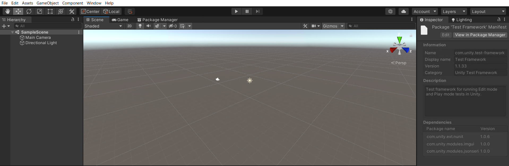
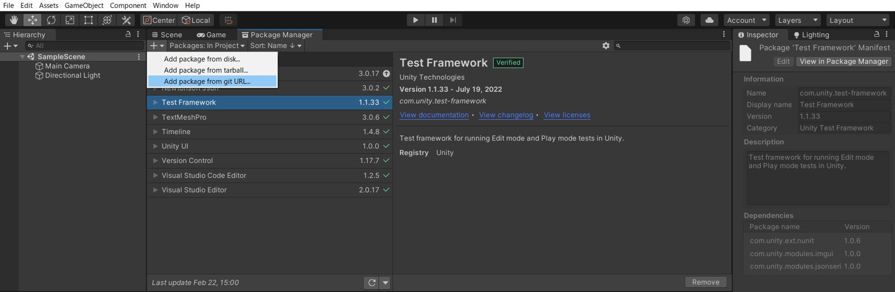
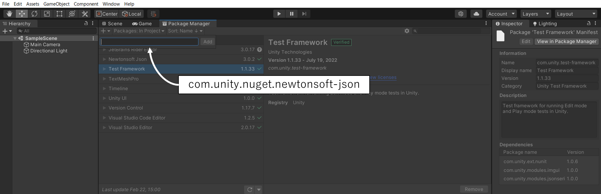
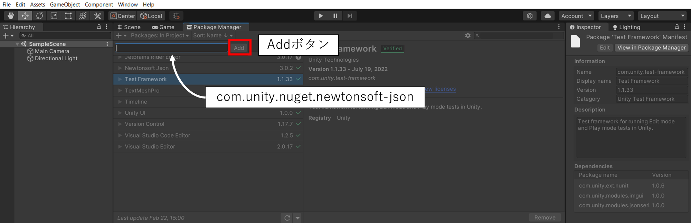

# 必要ライセンス、必要パッケージ
ここでは、歩行シミュレーション結果アセットに必要なライセンス、パッケージを記載します。

## 必要ライセンス
- Unity Personal以上
    - 参考：Unity [Choose the plan that is right for you](https://store.unity.com/compare-plans)

## 必要パッケージ
- Newtonsoft Json
    - インストールの方法は次の手順の通りです。
    
1. Unityプロジェクトを立ち上げると、「Package Manager」がタブに表示されます。
    
    
2. そのタブをクリックし、「+」ボタンを押すと、「Add package from git URL…」が表示されるので、クリックします。
    
    
3. テキストボックスが表示されるので、「com.unity.nuget.newtonsoft-json」と記入します。
    
    
4. 「Add」ボタンを押すと、インストールが完了します。
    