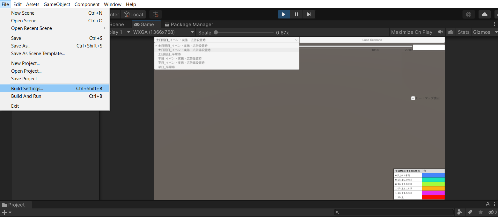
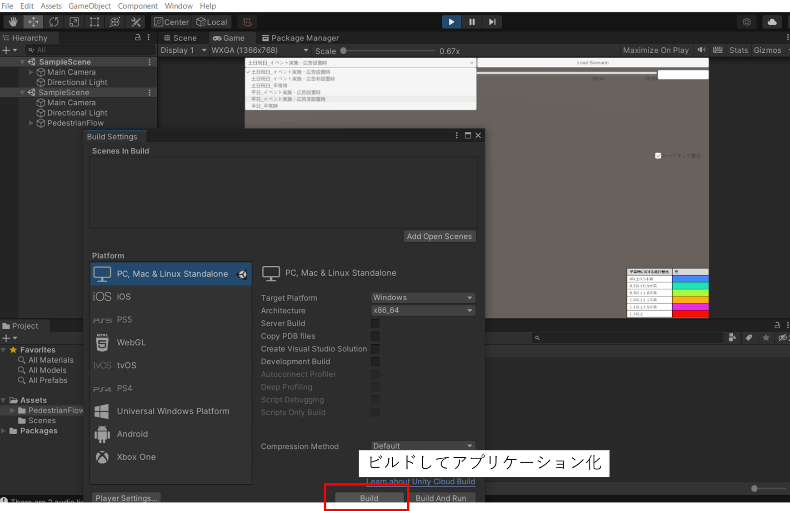

# 参考：Unity実行ファイルの作成
ここでは、Unityエディタから実行ファイル（EXEファイル）を作成する方法を記載します。

## アプリケーションのビルド
1. Unityエディタの画面から、「File」>「Build Settings」を選択します。

2. 「Build Settings」の画面から、「Build」を実行すると、Windowsデスクトップ版でのアプリケーションの実行ファイル（EXEファイル）が作成されます。
必要に応じて、別形式（スマートフォン対応等）の作成も可能です。

