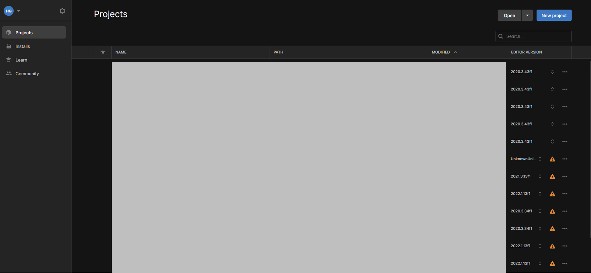

# 参考：Unityのインストール方法
ここでは、Unityのインストール方法について記載します。

## 対応Unityのインスト―ル
1. Unity Hubをインストールします。Unity Hubは[こちら](https://unity.com/ja/unity-hub)からダウンロードできます。
- Unity HubはUnityの任意のバージョンをインストールして起動できるソフトウェアです。

2. Unity Hubを起動し、サイドバーから「Installs」→「Install Editor」をクリックします。

3. Unityのバージョンをインストールします。なお、歩行シミュレーション結果アセットでは、Unity LTS Release2021.3.19f1（2023年1月時点における長期サポートバージョン）での動作を確認しています。

## Unityプロジェクトの作成
1. Unity Hubのサイドバーから「Projects」を押し、右上の「New Project」からUnityプロジェクトを作成します。

2. Unityプロジェクト作成の際、「Editor Version」を設定のうえ、テンプレートを「3D」とし、任意のプロジェクト名を付け作成します。

