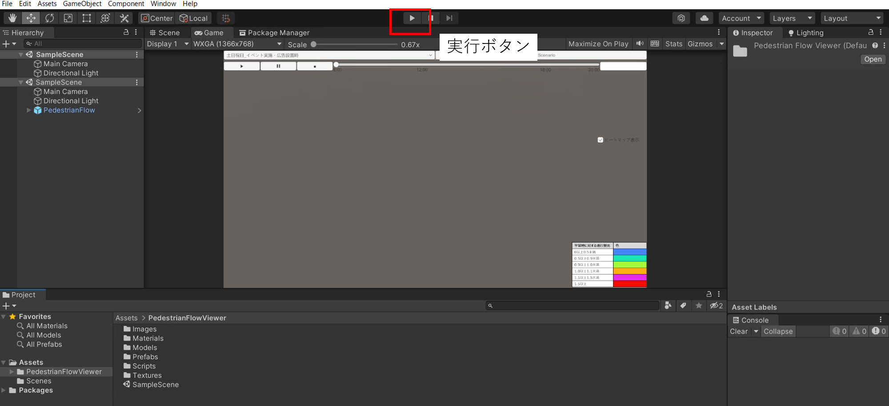
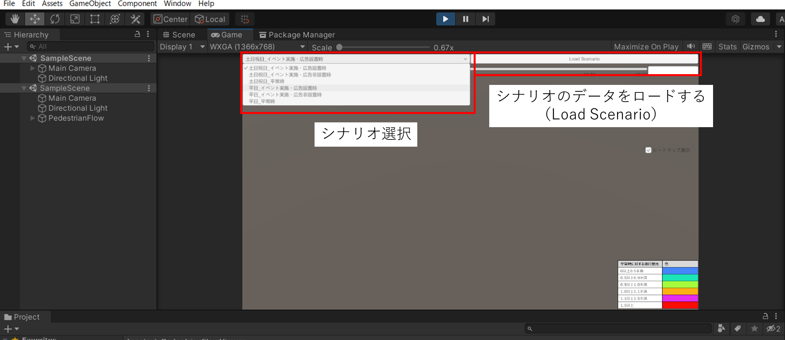

# 歩行シミュレーション結果可視化実行
ここでは、歩行シミュレーション結果を可視化する実行方法について記載します。

なお、本アセットで実装した機能を実行ファイルで確認したい場合は、[参考：Unity実行ファイル](UnityExe.md)を参照のうえご確認ください。

## 実行手順
1. 「Assets」>「PedestrianFlowViewer」内にある「Sample Scene」を「Hierarchy」にドラッグアンドドロップします。

2. 実行ボタンを押すと、データのロードが始まります。

3. 「Game」画面に移り、実行するシナリオをGame画面上部プルダウンから選択し、「Load Scenario」を押すと、シミュレーション結果データが読み込まれます。
