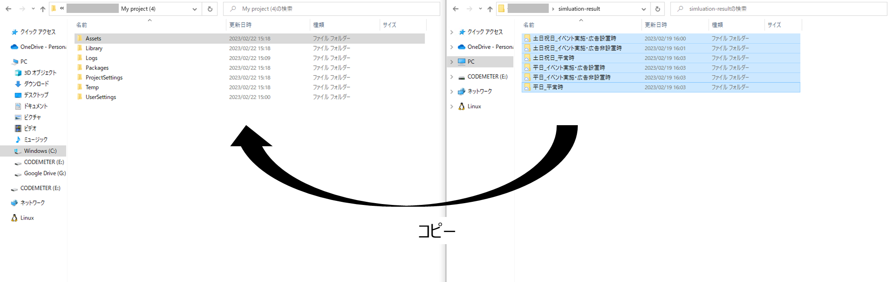
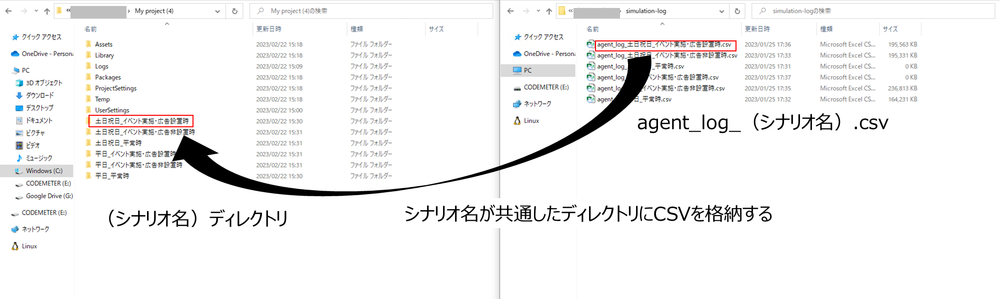

# 歩行シミュレーション結果可視化準備
ここでは、歩行シミュレーション結果を可視化するための準備方法について記載します。

## 実行準備手順
1. 「PLATEAU-UC22-023-Pedestrian-Simulation-Result-Viewer.zip」内にある、「simulation-result」内にある下記6ファイルを、「Assets」と同じディレクトリに格納してください。

- 平日_平常時
- 平日_イベント実施・広告設置時
- 平日_イベント実施・広告非設置時
- 土日祝日_平常時
- 土日祝日_イベント実施・広告設置時
- 土日祝日_イベント実施・広告非設置時

2. また、「simulation-result」内には「simulation-log.zip」が格納されているので同ファイルを併せて解凍してください。

3. 「simulation-log.zip」を解凍すると、下記6ファイルが含まれています。下記ファイルを1. で格納したディレクトリに格納してください。
- agent_log_平日_平常時.csv　
    （-> 「平日_平常時」直下に格納してください。）
- agent_log_平日_イベント実施・広告設置時.csv
    　（-> 「平日_イベント実施・広告設置時」直下に格納してください。）
- agent_log_平日_イベント実施・広告非設置時.csv
    　（-> 「平日_イベント実施・広告非設置時」直下に格納してください。）
- agent_log_土日祝日_平常時.csv
    　（-> 「土日祝日_平常時」直下に格納してください。）
- agent_log_土日祝日_イベント実施・広告設置時.csv
    　（-> 「土日祝日_イベント実施・広告設置時」直下に格納してください。）
- agent_log_土日祝日_イベント実施・広告非設置時.csv　
    （-> 「土日祝日_イベント実施・広告非設置時」直下に格納してください。）
