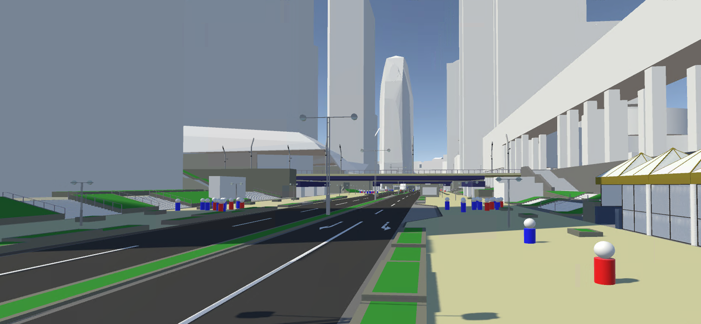

# UC22-023「歩行者移動・回遊行動シミュレーション」　歩行シミュレーション結果表示アセット
本マニュアルは、国土交通省民間ユースケース開発UC22-023「歩行者移動・回遊行動シミュレーション」における、歩行シミュレーション結果を表示するUnityアセットの利用方法及び説明となります。

なお、本アセットに3D都市モデルは含まれておりません。

- インストール方法
1. [インストール方法](./articles/Installation.md)
- 利用準備
1. [歩行シミュレーション結果可視化準備](./articles/VisualizationPreparation.md)
2. [歩行シミュレーション結果可視化実行](./articles/VisualizationEexcution.md)
- シミュレーション結果の可視化
1. [エージェント可視化機能](./articles/FunctionAgentVisualization.md) 
2. [人流切り替え機能](./articles/FunctionScenarioChange.md) 
3. [ガイド機能](./articles/FunctionGuide.md) 
- シミュレーション結果の分析
1. [ヒートマップ機能](./articles/FunctionHeatmap.md) 
2. [時系列人流可視化機能](./articles/FunctionSlider.md) 
3. [グラフ機能](./articles/FunctionGraph.md)
- 参考資料
1. [参考：Unityのインストール方法](./articles/UnityInstallation.md)
2. [参考：Unity実行ファイルの作成](./articles/UnityExe.md)

